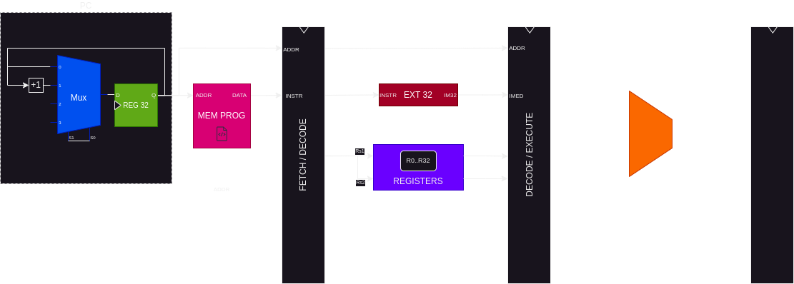

<h1 id="inicio" align="center">
   
  
   

Processador para Jogos

</h1>

Arquitetura do processador para uma plataforma de jogos.

## 📝 Como programar o processador?

> 🚧 WORKING IN PROGRESS

### ⬇️ Instruções do processador

- [Descrição dos estágios e instruções](./docs/estagios_intrucoes.md)

### ⬆️ Instruções de alto nível

> 🚧 WORKING IN PROGRESS

## 🧩 Exemplos

> 🚧 WORKING IN PROGRESS
