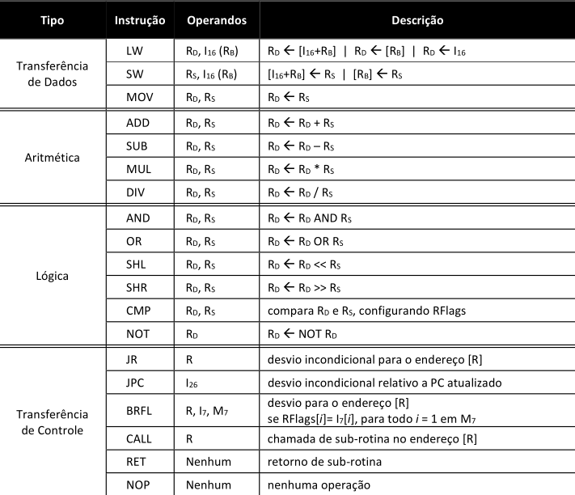

<h1 id="inicio" align="center">
  <br>
  
  <br>

Processador para Jogos

</h1>

[< Voltar](../README.md)

## Como programar



Crie um arquivo com as instruções de acordo com a tabela acima ou use o [editor web](https://taffarel55.github.io/lab4-compiler/)

```asm=1
// main.asm
lw     r3 4 (r6)
sw r4, 5, r7, 2
sw r4, 5(r7)
mov r4 r4
add r4, r5
mul r4, r5
div r2, r6
and r2, r3, r3

```

Execute a compilação:

```bash
npx lab4-compiler main.asm --debug=true[optional]

SANITIZADO: [
  "LW R3 4 (R6)",
  "SW R4, 5, R7",
  "SW R4, 5(R7)"
]
ANÁLISE DOS MNEMÔNICOS: [
  {
    "line": 1,
    "mnemonic": "LW",
    "number": "0",
    "group": "DT",
    "body": "R3 4 R6"
  },
  {
    "line": 2,
    "mnemonic": "SW",
    "number": "1",
    "group": "DT",
    "body": "R4 5 R7"
  },
  {
    "line": 3,
    "mnemonic": "SW",
    "number": "1",
    "group": "DT",
    "body": "R4 5 R7"
  }
]
ANÁLISE LÉXICA: [
  {
    "line": 1,
    "mnemonic": "LW",
    "number": "0",
    "group": "DT",
    "body": "R3 4 R6",
    "numOfOperands": 3,
    "destiny": "R3",
    "immediate": "4",
    "base": "R6"
  },
  {
    "line": 2,
    "mnemonic": "SW",
    "number": "1",
    "group": "DT",
    "body": "R4 5 R7",
    "numOfOperands": 3,
    "source": "R4",
    "immediate": "5",
    "base": "R7"
  },
  {
    "line": 3,
    "mnemonic": "SW",
    "number": "1",
    "group": "DT",
    "body": "R4 5 R7",
    "numOfOperands": 3,
    "source": "R4",
    "immediate": "5",
    "base": "R7"
  }
]
ANÁLISE SEMÂNTICA OK


Arquivo de saída (main.asm.txt) criado com sucesso.
```
