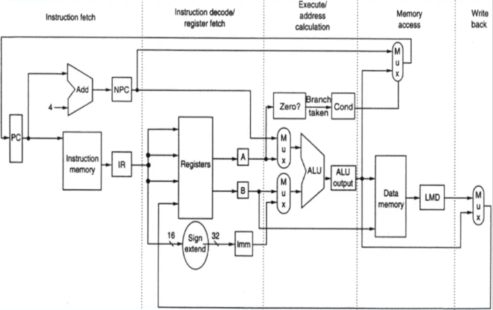
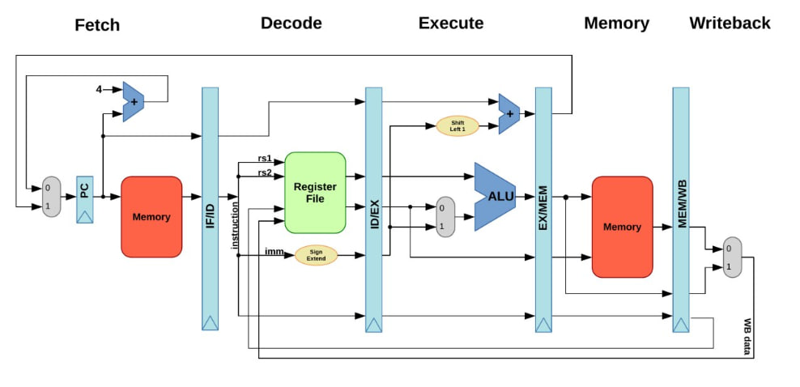
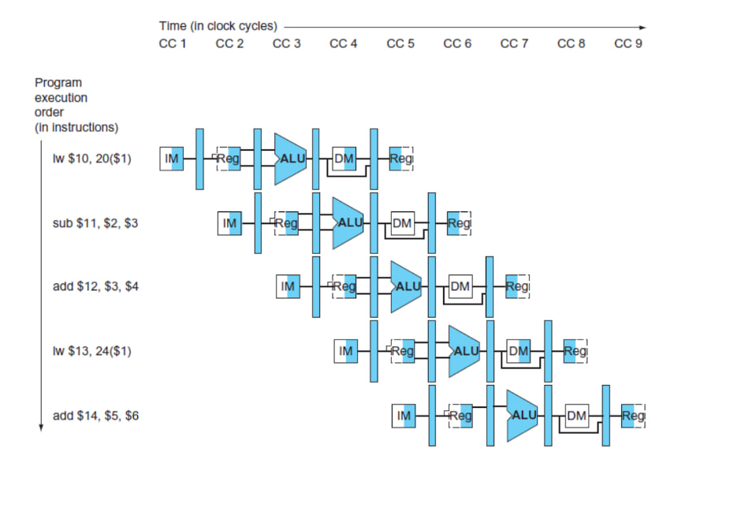
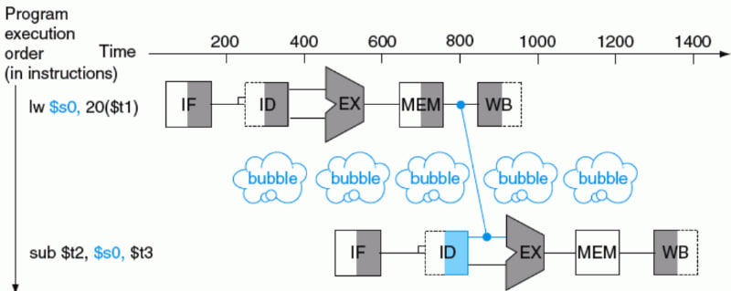
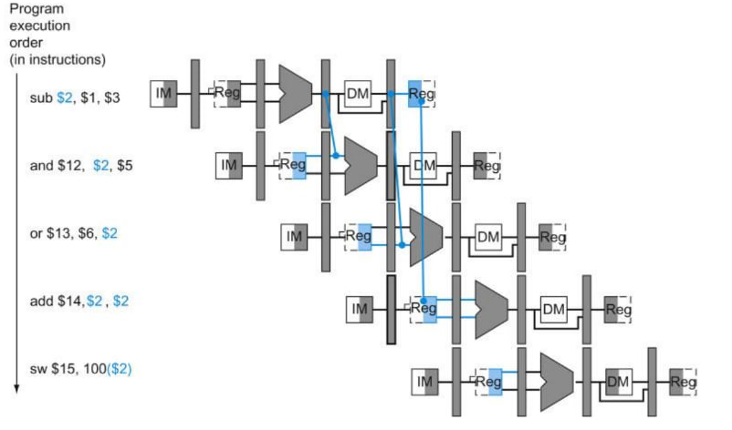

<h1 id="inicio" align="center">
   
  
   

Processador para Jogos

</h1>

[< Voltar](../README.md)

## Arquitetura Serial

### Instruction fetch:

   

- Busca da instrução na memória de instruções.
- O seu software está na memória de instruções e os dados com o qual ele trabalha está dentro da memória de dados
- O program Counter -> endereça uma determinada linha na instrução de memória. Supondo PC = 0
  -  Ele vai na posição 0, pega o conteúdo da posição 0,1,2,3, aglutina e manda essa informação para dentro do IR.
  - Além disso, o contador de programa é incrementado em 4, já que as instruções são acessadas de 4 em 4 bytes. Esse valor é passado para o NPC
### Instruction decode/ register fetch
- Depois que se busca a instrução na memória, o que é que tem que ser feito com essa instrução? Decodificação da instrução e busca dos operandos:
  - Por ser uma arquitetura RISC, os operandos devem estar no banco de registradores. Ou seja, qualquer operação que eu faça eu tenho que acessar o banco de registradores. (Em algum momento os dados podem estar na Data Memory)
    - Dentre as instruções que acessam a memória tem-se, duas,  Load, que é a instrução que carrega um valor que está na memória para o banco de registradores. Tem também a instrução Store, armazenar um valor em um determinado endereço da memória de dados.
- Quando uma leitura é feita, o valor é armazenado no banco de registradores
- É no IR que temos um código binário, linguagem de máquina, uma palavra. É lá que tem um OPCODE
- Vamos supor que seja uma operação de soma
  - A operação de soma envolve dois registradores que são os operandos. O resultado dessa operação deve ser armazenada em um terceiro registrador ou em um dos dois envolvidos.
  - No caso da foto acima, pega-se o conteúdo do primeiro operando e joga no temporário A. Pega-se ainda o conteúdo do segundo operando e joga no temporário B. 
  - A soma é feita e na própria instrução do IR sabe-se qual é o destino
- Pode-se ainda realizar uma soma envolvendo um registrador e um valor imediato. O que é o valor imediato? É um valor que vem escrito dentro da própria instrução do IR. É uma constante. No caso da imagem é uma constante de 16 bits. Só que, o conteúdo dos registradores é de 32 bits. 
  - E agora? Eu pego essa constante de 16 bits e passo para um imediato de 32 bits
    - Se o número for positivo basta preencher com 0 à esquerda
    - Quando o número é negativo não dá para preencher com 0 à esquerda. Eu tenho que preencher com 1.
- Em resumo é isso  que essa etapa faz, eu faço o que é para ser feito com base no OPCODE do IR
### Execute/address calculation
- O que é a execução? Realizar de fato uma operação aritmética na ULA.
- O que é o cálculo de endereço? É quando eu preciso calcular o endereço para uma operação Load Store, por exemplo.
- Essa arquitetura funciona baseada em base-deslocamento. O que isso quer dizer?
  - Quando eu preciso acessar a memória eu preciso fornecer, um valor base, pode ser o A e um valor de deslocamento. O valor de deslocamento pode estar em B ou no próprio imediato.
- Eu posso fazer uma operação em que eu pego o valor do NPC e somo com o imediato por exemplo.
  - Qual o significado desse cálculo? O NPC identifica qual a próxima instrução a ser executada na memória de instrução.
  - Em um laço for, por exemplo, você executa uma série de comandos. Quando chegar ao final, eu preciso voltar o escopo e verificar se a condição foi atendida ou não. Esse salto para a primeira linha do begin ou para fora do bloco for é realizada através da interação entre o NPC e o Imediato.
    - O resultado dessa operação vai me dar um resultado que vai para PC. E lembre-se o PC dita qual instrução ele vai rodar na memória.
- Pode-se ainda ter um jump condicional
  - Nesse caso o conteúdo de um dos registradores temporários é utilizado para fazer um comparativo com o zero. Maior que zero, menor que zero, igual a zero?
  - Esse condicional está relacionado mais uma vez com uma instrução OPCODE. Eu uso esse condicional para decidir pelo desvio “branch” ou não.
    - A depender do resultado o bit Cond é setado como “1” ou “ “0”
    - Esse bit condicional Cond entra no Mux. Caso seja “1” dar um salto condicional, uma linha do Mux é ativada (O que tem na linha? Explicação a seguir). Caso não seja para dar um salto condicional, o valor do NPC é escolhido (Ou seja, é o valor do PC + 4).
    - A linha que representa o salto condicional está ligada à saída ALU output. Por quê?
      - Porque você tem que saber para onde deve ser esse salto. Ou seja, precisamos de um endereço de destino.
      - O endereço de destino pode ser baseado em um registrador “A” ou “B”. Por exemplo NPC + B ou NPC  + Imm. O resultado dessa operação vai para o Contador de Programa e aí acessamos a memória em um novo lugar, efetuando assim o salto.
  - Os desvios podem ser positivos ou negativos na memória de instrução. Para frente caso o desvio seja positivo ou para trás, caso o desvio seja negativo
### Write back
- É sobre atualizar o valor de um registrador. Vamos supor a soma de “A” + “B”. Esse valor está conectado a Data Memory, mas não precisamos acessar a memória e por isso fazemos um bypass. Se você perceber, o Write back está voltando para o banco de registradores.
  - Em qual registrador? No registrador de destino, terceira linha na imagem.
  - A quarta linha é o resultado.
### Memory Access
- Como dito, a memória precisa ser acessada em instruções LOAD e STORE. Como isso funciona?
  - A ALU te fornece uma saída, que é um endereço. Esse endereço é colocado no barramento de endereços da memória de dados. O endereço pode vir do registrador A + Imediato ou A + B
  - Se for uma instrução STORE, o dado que vai ser escrito na memória vem do registrador B.
  - No caso da instrução LOAD, A+B ou A + Imediato dá o endereço. Faz a leitura desse endereço fornecido e o resultado é armazenado em um intermediário chamado LMD (Load da memória de dados) e esse dado é selecionado pelo MUX para ser gravado em um determinado registrador de destino.
  
### O que acontece de modo geral em uma arquitetura serial?

- Executa uma instruction fetch. Busca a instrução na memória de instrução, decodifica ela, vê o que vai ser preciso, é operação lógica, aritmética, condicional, desvio condicional, desvio absoluto, armazenamento de valor, load, store identifica o que é para ser feito.
- Se for um caso para gerar um endereço para memória, se for um caso de gerar uma operação lógica aritmética, ou um caso de desvio, isso é feito na etapa de execução/ cálculo de endereçamento.
- Se for uma instrução que acessa a memória, isso é feito na etapa de Memory Access. Seja através da instrução LOAD ou da instrução STORE.
- Por último temos a atualização de um registrador através da etapa Write Back no banco de registradores(A instrução STORE não precisa disso, mas a atualização LOAD sim). Isso inclui o resultado de uma soma, divisão, multiplicação, etc…
- Depois de concluir o WriteBack é aí que eu volto para a primeira etapa que está em Instruction fetch: pega o conteúdo do PC e vou executar a próxima instrução que está na memória de instrução. Se no loop passado eu executei a instrução 1, agora eu vou executar a instrução 2. 
    - Como se pode observar, a arquitetura serial, é uma arquitetura em sequência, primeiro uma execução passa por todas as etapas e aí sim eu posso ir para uma segunda instrução.
- A pergunta que tem que ser respondida é:
    - Utilizar uma arquitetura serial atende os requisitos do projeto? Principalmente os requisitos de tempo. Caso a resposta seja não, eu quebro a arquitetura serial em várias etapas de processamento.
    - Ao quebrar em várias etapas chegamos na arquitetura com pipeline.

## Arquitetura com Pipeline

   

- O que eu estou fazendo é quebrando a instrução em 5 etapas diferentes e quebrando a arquitetura em 5 etapas.
  - São 5 estágios de pipeline
    - O primeiro estágio é responsável pela busca de instruções
    - O segundo estágio é responsável pela decodificação da instrução e busca de operandos.
    - O terceiro estágio é a fase de execução e o cálculo de endereço
    - O quarto estágio é sobre o acesso à memória
    - O quinto estágio realiza a atualização no banco de registradores
  - O que significa uma pipeline?
    - Você define um estágio específico que é desacoplado do resto das etapas.
    - Mas o que tá separando um estágio do outro? Parece quase igual à arquitetura serial.
      - Justamente os registradores. As barras verticais são grandes registradores.
      - O que eu vou armazenar nesses registradores que garantem o desacoplamento?
        - O IF/ID representam um registrador que vai fazer o papel do NPC e o IR(Instruction Register)
        - O ID/EX representa a junção dos temporários “A”, “B” e o Imediato.
          - É válido lembrar que o valor do NPC também está sendo passado para esse registrador.
          - Da mesma forma, as informações a respeito do IR, que são relevantes para essa etapa, também são copiadas para o ID/EX.
        - O EX/Mem representa a junção de Cond e da ALU Output
          - Vale mencionar que informações importantes do registrador ID/EX também são passadas para frente.
        - O MEM/WB condensa informações do LMB e recebe informações de barramento anterior.
- Uma pergunta que pode ser feita é: tá, mas eu só estou condensando informações em “barramentos”. Lá eu também podia consultar as informações  no NPC ou no IR, assim como podia consultar informações nos registradores “A”, “B” ou no próprio “Imediato”. Contudo, o que acontece no pipeline é o seguinte:
  - Imagine 10 instruções. A primeira instrução passa pelo primeiro estágio e o resultado é armazenado no registrador grandão IF/ID. A instrução 1 passa para o próximo estado onde vai ser decodificada e onde vai se buscar operandos para ela. De forma SIMULT NEA, a instrução 2 entra em execução em Instruction Fetch,já se busca a instrução 2 na memória de instrução, enquanto que a instrução 1 se encontra no estágio 2. É válido mencionar que esses registradores grandões são controlados via clock e dessa forma, quando acontecer mais um pulso de clock, a instrução 1 vai para o terceiro estágio, a 2 vai para o segundo estágio e a terceira instrução vai entrar em execução no primeiro estágio e assim sucessivamente conforme acontecem os pulsos de clock.
- Como se pode perceber, é possível ter 5 instruções sendo executadas ao mesmo tempo. Voilá, o paralelismo é garantido.
Como se pode imaginar, quando estamos trabalhando em pipeline, o tempo gasto em cada estágio é um fator a se preocupar.
  - Normalmente todos os estágios são majorados a partir da etapa mais lenta. Se a mais lenta demora 15 ns, todas as etapas durarão 15ns. Ahhh, mas se uma das etapas terminou em 5ns? Problema dessa etapa, vai ficar ociosa até completarmos os 15ns especificados.

   

- Como se pode observar, a partir do 6 pulso de clock o resultado de uma instrução é entregue.
  - É possível, por limitação de clock, ter mais pulsos de clock por etapa ou até mais etapas.
  - Cuidado também com a latência, que é o tempo entre a instrução entrar no primeiro estágio e sair ao último estágio
- Quando todos os estágios estão em execução dizemos que o pipeline está cheio.
  - É possível ainda que uma das instruções tenha desvio, então vamos supor que a segunda instrução tenha um desvio, a próxima instrução a ser executada não deve ser a terceira, deve ser a 21º. Aí que tá o problema, eu tenho que preparar minha arquitetura para saber lidar com esses casos de desvios em que a próxima instrução não deve ser sequencial
    - O que acontece no caso de um desvio seja por if ou for? Parte das instruções que estão para ser executadas vão ser descartadas.
    - Pipelines muito extensos devem ser evitados
- Outro problema para se preocupar em uma arquitetura de pipeline -> Read after Write
    - Imagine as seguintes instruções assembly:
      - add R1, R2, R3
      - sub R4,R1,R3
- Em uma estrutura de pipeline, como você garante que sub está pegando o valor de R1 atualizado após a adição?
  - Existe uma estratégia chamada bolha. Se eu não submeter a instrução, eu vou dar um shift na segunda instrução de tal forma que quando eu for ler o banco de registradores, quando a segunda instrução precisar, o registrador vai estar atualizado.

   

  - Qual o problema dessa abordagem? Como eu vou dar um shift de algumas bolhas na próxima instrução, em alguns pulsos de clock eu não vou produzir nada na saída da minha arquitetura ou seja não vai ter trabalho útil
- Existe uma segunda estratégia chamada de forwarding (antecipação de dados já prontos no pipeline). O resultado da soma realizada pela ULA fica no registrador entre a ULA e a Memória de Dados.

   

 

  - Quando eu for fazer a subtração, eu vou ver que esse registrador está em processamento e, portanto, eu não vou pegar o valor dele no banco de registradores, mas sim, nesse registrador intermediário entre a ULA e a Memória de Dados. Eu preciso sinalizar isso ao multiplexador.

