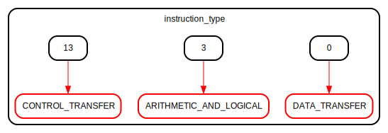

# Entity: extensor 
- **File**: extensor.v
- **Title:**  Extensor de Bits
- **Author:**  brenoamin, taffarel55

## Diagram

## Description

Um extensor de bits é um componente que expande o tamanho
de um valor imediato de acordo com o tipo de instrução.
Este módulo Verilog aceita uma instrução de 32 bits
e gera um valor imediato de 32 bits como saída.

 

 

 

 

## Ports

| Port name   | Direction | Type        | Description                        |
| ----------- | --------- | ----------- | ---------------------------------- |
| instruction | input     | wire [31:0] | Entrada da instrução de 32 bits    |
| immediate   | output    | [31:0]      | Saída do valor imediato de 32 bits |

## Signals

| Name             | Type        | Description                                           |
| ---------------- | ----------- | ----------------------------------------------------- |
| instruction_type | reg [1:0]   | Tipo de instrução extraído da instrução de entrada;   |
| immediate_dt     | wire [15:0] | Imediato para instruções de Transferência de Dados    |
| immediate_al     | wire [11:0] | Imediato para instruções Aritméticas e Lógicas        |
| immediate_ct     | wire [26:0] | Imediato para instruções de Transferência de Controle |

## Constants

| Name                   | Type | Value    | Description                                        |
| ---------------------- | ---- | -------- | -------------------------------------------------- |
| DATA_TRANSFER          |      | 5'b00000 | Tipo de instrução: Transferência de Dados          |
| ARITHMETIC_AND_LOGICAL |      | 5'b00001 | Tipo de instrução: Operações Aritméticas e Lógicas |
| CONTROL_TRANSFER       |      | 5'b00010 | Tipo de instrução: Transferência de Controle       |

## Processes
- EXT32: ( @(*) )
  - **Type:** always
  - **Description**
  Lógica para determinar o valor imediato baseado no tipo de instrução 
- get_instruction_type: ( @(*) )
  - **Type:** always
  - **Description**
  Extração do tipo de instrução 

## State machines

- Extração do tipo de instrução